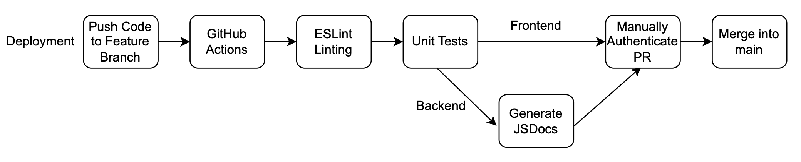

# **CI/CD Pipeline — Phase 1 Status Report**

## **Overview**

For Phase 1, we implemented a reliable CI/CD pipeline that enforces code quality, testing, and review standards for the **Node.js backend** and lightweight **HTML/CSS/JS frontend** of the Conductor Tool.
All changes must go through reviewed pull requests, and direct pushes to the protected branch are blocked.

The pipeline runs automatically on:

* Pull requests targeting the protected branch `main`
* Pushes created by merging approved PRs

This ensures consistency, reliability, and repeatability in our development process.

## **Current CI/CD Workflows**

### **Backend & Frontend Linting**

* ESLint validates JavaScript code across backend and frontend.
* Any lint error fails the pipeline, preventing low-quality or inconsistent code from merging.

### **Backend Testing (Node + Supertest)**

* Uses Node’s built-in test runner for speed and clarity.
* Supertest validates key Express routes.
* Failing tests block pull requests from merging.

### **JSDoc Validation**

* CI verifies that backend documentation builds without errors.
* Prevents broken or missing documentation in long-term development.

### **Continuous Delivery Packaging**

* The pipeline packages the application into a `.tar` archive as a deployable artifact.
* This prepares the system for future automated deployments.

*(Frontend tests will be added in later phases.)*

## **Pipeline Diagram**

## **Branch Protection Rules**

The protected branch requires:

* **Successful CI checks** (lint, test, documentation, packaging)
* **At least one reviewer approval**
* **No direct pushes**

This ensures that all code merged into the mainline is reviewed, validated, and reproducible.

## **Future Roadmap (High-Level Summary)**

To build toward a robust production-ready system, future phases of the pipeline will introduce:

### **Quality & Coverage Improvements**

* **Codacy integration** (automated code quality, maintainability checks)
* **Jest testing** for backend unit and integration tests
* **Cypress** for end-to-end UI interaction testing

### **Deployment & Infrastructure**

* Deployment to **AWS** using ECS Fargate or Elastic Beanstalk
* CI/CD pipeline extension to handle staging + production environments

### **Documentation & Developer Experience**

* Optional publishing of JSDoc to S3 or GitHub Pages
* Coverage reports and test dashboards

Full technical justifications and architectural reasoning for these planned additions are documented in our ADR directory:

> **`Conductor-App/specs/pitch/adrs`**

Only short summaries are shown here due to page length constraints.

## **References**

Detailed ADRs covering cloud selection, CI/CD strategy, testing methodology, logging, and deployment planning can be found in:

> **`Conductor-App/specs/pitch/adrs`**

These documents provide full context for all design choices and long-term architectural direction.
